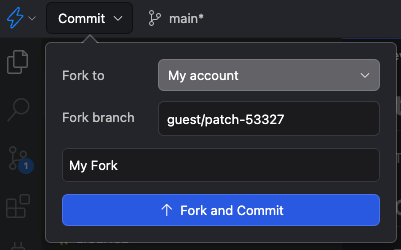

import YouTube from '../../../components/YouTube.astro';

## Adding Types and Tooling for SSF

Most of us developers that are picking up SSF are coming from the strongly typed world of C# and being faced with the reality that JavaScript is an unruly kind of language where basically anything goes. That prospect is quite unnerving and naturally triggers some red flags for a lot of us. Fortunately, there is a solution - TypeScript.

## TLDR

- [x] New types available for SSF via NPM (including plugins)

```javascript
npm install @types/elliemae__em-ssf-guest
```

- [x] Example projects available on GitHub and StackBlitz (cloud ready dev environments with a free tier)
  - [Plugin GitHub Repository](https://github.com/dex2dot0/tsweb-plugin)
  - [Node Web App Repository](https://github.com/dex2dot0/tsweb-custom-tool)
  - [Plugin StackBlitz](https://stackblitz.com/~/github.com/dex2dot0/tsweb-plugin)
  - [Node Web App StackBlitz](https://stackblitz.com/~/github.com/dex2dot0/tsweb-custom-tool)
- [x] Plugin bundling capabilities
- [x] Multiple bundling options

**Note** If you go the StackBlitz route, you will have to create a fork of the project. You can sign up for free and use a cloud dev machine for a set number of hours per month. This is a great option if you just want to play around for a while without having to setup everything on your local machine.

## Typescript Overview

TypeScript has been building in popularity over the past couple of decades or so and has gained a lot of adoption within the broader JavaScript community and for good reason. Coding without type support to those used to strong typing is a lot like trying to navigate blind; its uncomfortable and scary. Moreover, being scared is probably the right response as type errors are likely the most common source of bugs that occur.

So what is TypeScript really? Its a couple of things actually. To dig in a bit deeper, check out [Typescript for the New Programmer](https://www.typescriptlang.org/docs/handbook/typescript-from-scratch.html). For those that are new to TypeScript coming from C# [TypeScript for Java/C# Programmers](https://www.typescriptlang.org/docs/handbook/typescript-in-5-minutes-oop.html)

Learning a new language is often pretty daunting. To add insult to injury, you may be learning a new language (JavaScript) and now hearing there's actually a subset of it that you might want to get comfortable with as well. Fortunately there is a wealth of great free resources on the web to help with the learning journey and strong incentives to adopt TypeScript in order to gain the safety & tooling that actually makes things easier.

### Why Should You Care?

- Reduce errors and bugs
- Type inference (think intellisense)
- Code documentation you can reference and review in your editor (for IDEs that support it)
- Learning and using TypeScript will make for a happier JavaScript experience in the long-term

## Getting Started

**Note** Both GitHub and StackBlitz have README pages that have additional relevant information for reference.

### GitHub

For those that prefer to setup something on their local machines, you can fork the repositories in GitHub:

[Plugin](https://github.com/dex2dot0/tsweb-plugin)

[Node Web App](https://github.com/dex2dot0/tsweb-custom-tool)

The projects are setup to use [PNPM](https://pnpm.io/) which will handle both the node modules you need as well as your node version(s). I've used NPM, Yarn, and PNPM in the past and have really enjoyed the dev experience that PNPM offers. You of course are free to use whatever you'd like.

**Note** Some node commands may need to be modified as pnpm might be hard-coded in the package.json scripts.

### StackBlitz

**You will need to sign up for a free account in order to save any of your progress!**

For those that are looking to jump right in without having to do local setup, StackBlitz is what you'll be looking for. [StackBlitz](https://stackblitz.com/) is an awesome service that gives you a cloud based development machine. This makes it very easy to get started as you don't have to wrangle with installations and setup on your local machine. It's a great service and has a fairly generous free tier.

[StackBlitz Plugin](https://stackblitz.com/~/github.com/dex2dot0/tsweb-plugin)

[StackBlitz Node Web App](https://stackblitz.com/~/github.com/dex2dot0/tsweb-custom-tool)

#### StackBlitz Setup

1. Sign up for a free account
2. Visit one of the links above for either of the StackBlitz projects
3. Create a fork of the project
   
4. You should now be able to freely edit and save your forked version

When you launch the project, all the installation and tooling should be automatic and already handled for you, this is part of the magic of StackBlitz. If you are using the node web app, it should immediately start running the development server.

### Using the Examples

Refer to the project README.md files for more details on how to utilize each. In the near future I will also record and post a video that goes in to greater detail on how to use each project and the nuances involved.

**Plugin**

The plugin project provides a template for writing plugins in typescript with support for bundling the output in JavaScript. It provides 4 different options for bundling:

1. Unminified single file
2. Minified single file
3. Unminified split files
4. Minified split files

You can modify the [esbuild](https://esbuild.github.io/) configuration to further support your particular needs.

After running one of the build commands from the package.json scripts, the output JavaScript should generate to the dist folder. This is the output you can then upload as a plugin asset.

**Node Web App**

The web app is an oversimplified example of using the @types package to get type support in a Node project. It is not really meant to be a model for a production ready project. That is not to say that the frameworks used or approach are not suitable for production, rather its a minimal example and is intended to serve as a playground.

## What's Next?

- Video walk through
- Increasing type coverage of the @types package
- Exploring additional tooling options and ways to continue supporting an improved developer experience
